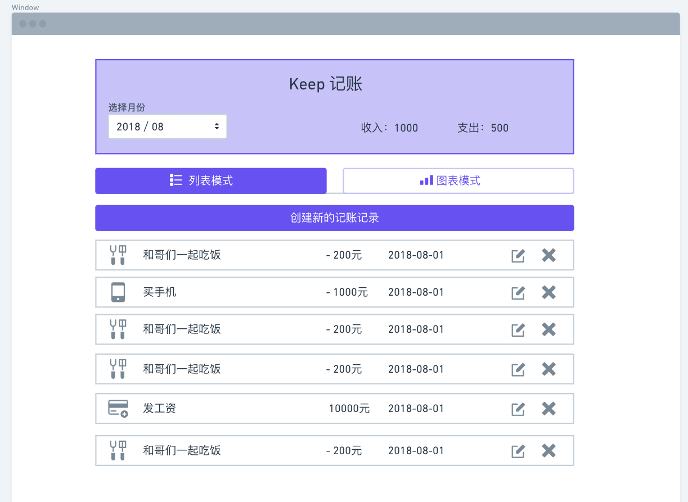
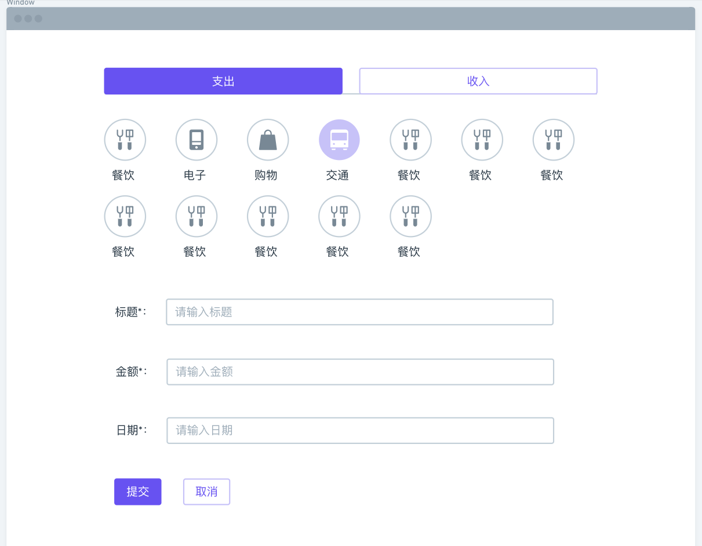
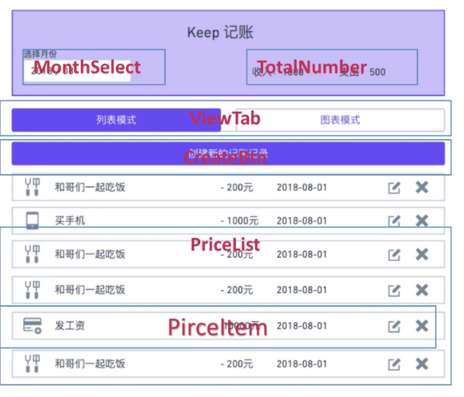

# React 在线账本

”在线账本”实战项目，以 ‘React理念’为指导思想，从头到尾的实践一个项目是怎样从设计图到最终的线上产品。

一步一步从设计图出发，到组件拆分，组合，状态分析，数据流分析，组件测试、页面整合，再到搭建 Mock Server，对接后端接口，实现前后端分离开发，最终到部署上线。由浅入深的学习 React 的实际应用的开发模式和流程。


### 需求分析

 - 在线账本，记录每月花销
 - 首页以列表方式展示当月花销
 - 可选择月份查看对应月花销
 - 可新加账单记录，记录需以下信息：收入/支出、类型、时间、金额大小、事项标题。

### 原型分析



点击选择月份则会出现一个日历选择器，点击月份就会展示这个月对应的账单。


在首页点击创建新的记账记录，则会跳到创建编辑页。



在首页点击图标模式，跳到图表页。


### 展示型组件
 - 关心数据的展示方式
 - 不依赖app中的其它文件
 - 不关心数据是如何加载和变化的
 - 仅通过`props`接受数据和回调函数
 - 除非需要用到`state`，声明周期函数或性能优化，通常写出函数式组件


### 容器型组件
 - 关心数据的运作方式
 - 为展示型组件提供数据和操作数据的方法
 - 为展示型组件提供回调函数
 - 通常是有状态的，并且作为数据源存在


### 项目文件夹结构
 - `components` 文件夹存放所有的展示型组件
 - `containers` 文件夹存放所有的容器型组件
 - 这两个文件夹下的`__test__`文件夹存放所有的组建测试文件
 - 文件使用 Pascal Case 命名规范
 - src根目录下放统一使用的一些文件

```
│  index.js
│
├─components
│  │  ComponentName.js
│  │
│  └─__test__
│          ComponentName.test.js
│
└─containers
    │  ComponentName.js

    └─__test__
            ComponentName.test.js
```

### Airbnb React/JSX 中文编码规范
[Airbnb React/JSX 中文编码规范](https://github.com/JasonBoy/javascript/tree/master/react)


### React理念
[React理念](https://react.docschina.org/docs/thinking-in-react.html)


### 首页组件划分
